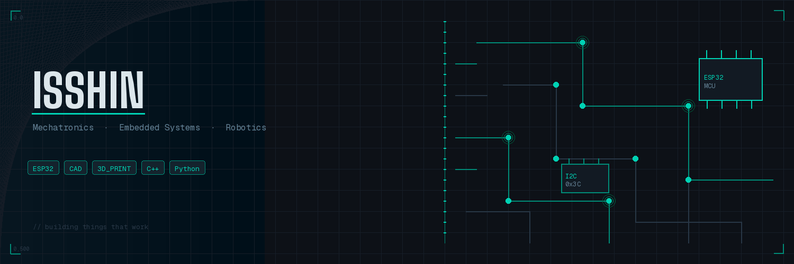

<!-- ═══════════════════════════════════════════════════════════════ -->
<!--              NERVGEAR INTERFACE · PROFILE v2.077              -->
<!-- ═══════════════════════════════════════════════════════════════ -->

<div align="center">

[](https://github.com/isshin-2)

<br/><br/>

### ❝ System Call: Initialize User Interface — Link Start! ❞

<br/>


</div>

---

<br/>

## 〔 PLAYER DATA 〕

```yaml
Username  : isshin-2
Class     : Student Engineer — Embedded Systems & Mechatronics
Server    : Chennai, Tamil Nadu 🇮🇳
Status    : ◉ ONLINE  — Building things that shouldn't exist yet
Quest Log : Astro Desk Robot · Verdex Kappa · Agritech Rover · PCB Design
```

<br/>

---

## 〔 SKILL TREE 〕

```
◈ System Call! [Generate] [Circuit]   [Etch]!          PCB Design · EasyEDA
◈ System Call! [Generate] [Firmware]  [Compile]!        Embedded C++ · ESP32 · Arduino
◈ System Call! [Generate] [Script]    [Execute]!         Python
◈ System Call! [Generate] [Object]    [Materialize]!    CAD & 3D Printing · Ender 3 V3 SE
◈ System Call! [Generate] [Automaton] [Synchronize]!    Robotics & Motor Control
◈ System Call! [Generate] [Signal]    [Propagate]!      LoRa · WiFi · BLE · I2S
◈ System Call! [Generate] [Mesh]      [Render]!          3D Modelling & Simulation
```

<br/>

---

## 〔 INVENTORY — ACTIVE QUESTS 〕

<table>
<tr>
<td width="50%">

### ⚔ Astro — Desk Robot
> ESP32-C3 SuperMini · OLED expressions · Touch & voice reactions · Motor behaviours · ToF proximity · WiFi Telnet debug

**Status:** `▓▓▓▓▓▓▒▒░░` In Progress

</td>
<td width="50%">

### 🛡 Dual-MCU Dev Board
> Arduino Mega + ESP32-C5 · ILI9341 Touchscreen · IMU · LoRa SX1278 · MAX98357A Audio · BME280 · VL53L0X

**Status:** `▓▓▓▓▓▒▒▒░░` In Progress

</td>
</tr>
<tr>
<td>

### 🌾 Agritech Rover
> ESP32 · Smart agriculture monitoring · LED status indicators · Wireless sensor node · Field data logging

**Status:** `▓▓▓▒▒▒▒░░░` Planned

</td>
<td>

### 🔷 Verdex Kappa — C5 Dev Board
> Arduino Mega + ESP32-C5 · ILI9341 Touchscreen · ICM-42688-P IMU · LoRa SX1278 · MAX98357A Audio · BME280 · VL53L0X

**Status:** `▓▓▓▓▓▒▒▒░░` In Progress

</td>
</tr>
</table>

<br/>

---

## 〔 SYSTEM STATS 〕

<div align="center">

<table><tr>
<td></td>
<td></td>
<td></td>
  //hello there? what are you doing here?
</tr></table>

</div>

<br/>

---

## 〔 FIND ME 〕

<div align="center">

[](https://github.com/isshin-2)
[](https://instagram.com/isshin2_)

</div>

<br/>

---

<div align="center">

<samp>

```
╔══════════════════════════════════════════════════════════╗
║   [ CONNECTION STABLE ] · [ PING: — ms ] · [ HP: ███ ]   ║
║  "This may be a virtual world, but I feel more alive     ║
║         here than in the real world."                    ║
╚══════════════════════════════════════════════════════════╝
```

</samp>

</div>
